# СНТР - сайт научно-технологического развития

Данный сайт представляет собой СППР для научных сотрудников и центров 

## Интерфейс страницы поиска центров компетенций 
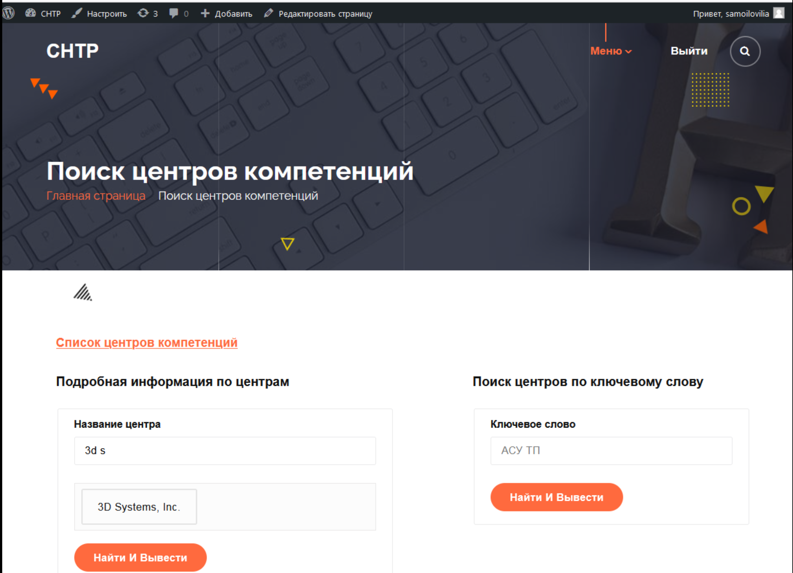

## Интерфейс страницы найденных центров компетенции
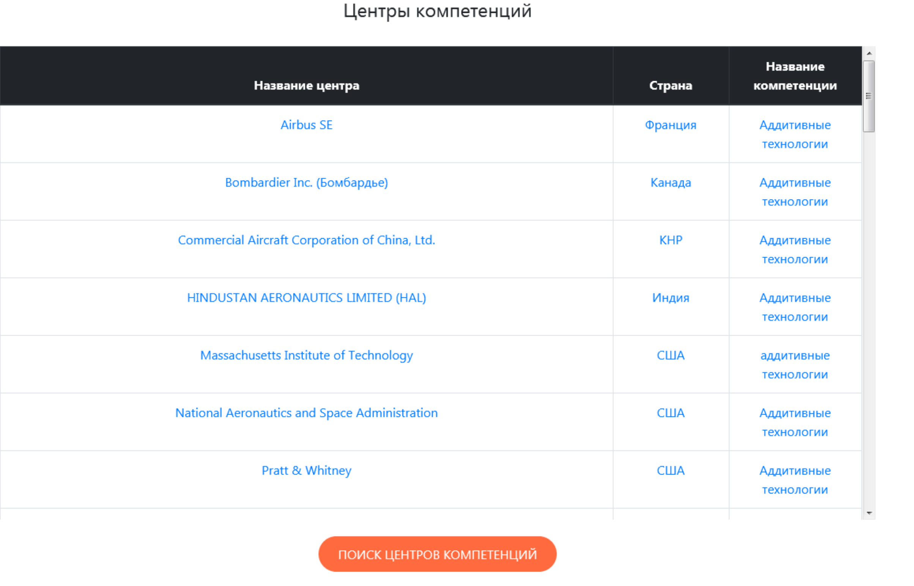

## Интерфейс страницы поиска центров с учетом приоритета

## Интерфейс страницы поиска компетенций
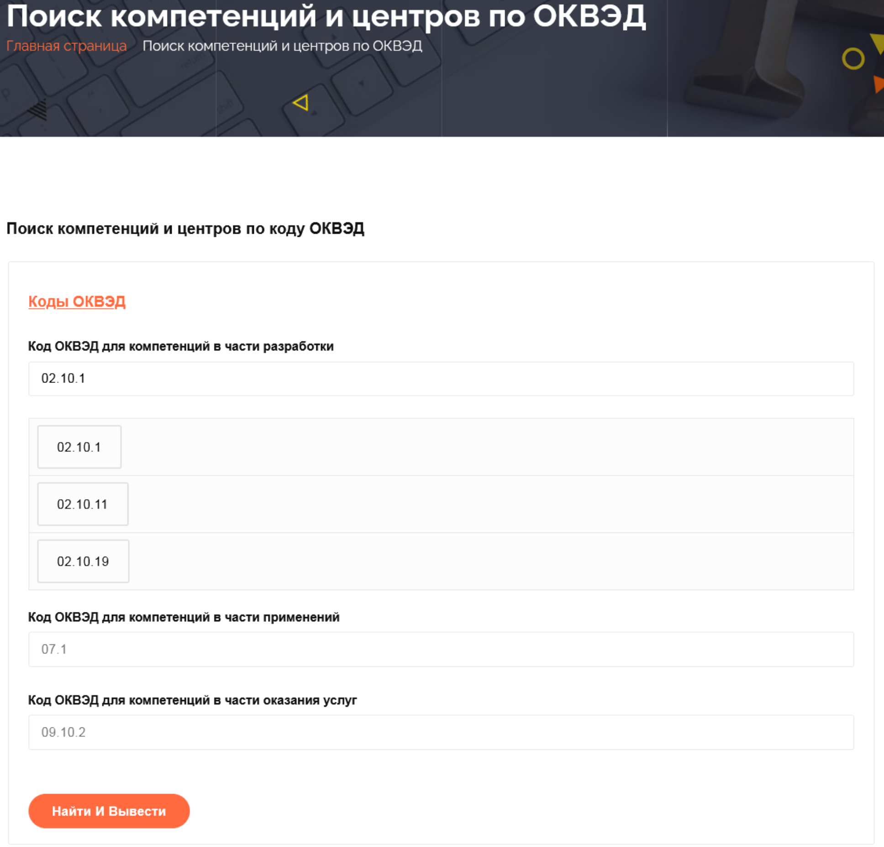

## Интерфейс страницы разделов ОКВЭД - классификатор экономической деятельности
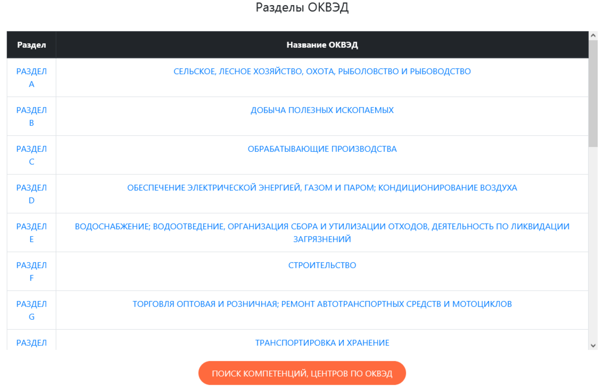

## Интерфейс страницы ОКВЭД первого уровня
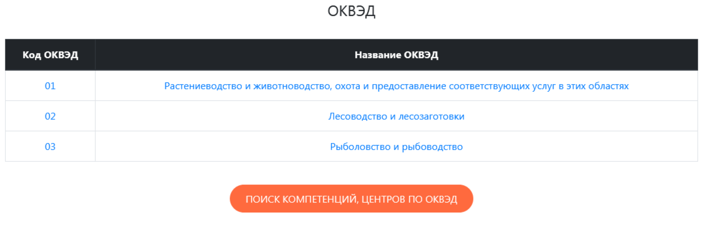

## Интерфейс страницы ОКВЭД второго уровня
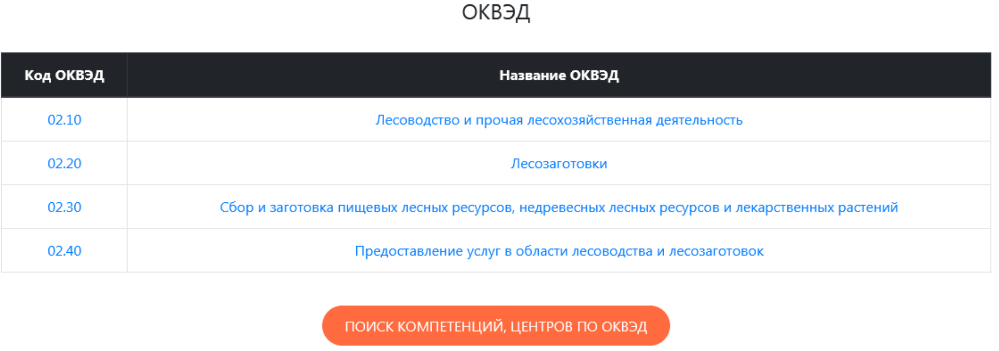

## Интерфейс страницы ОКВЭД третьего уровня
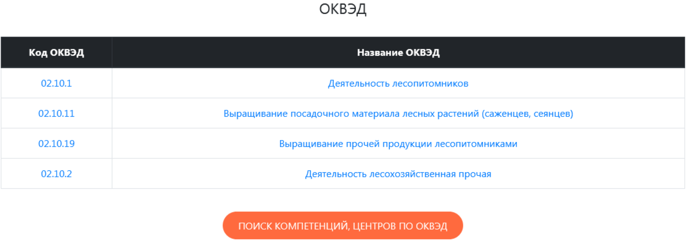

## Интерфейс страницы поиска центров по компетенция и связанным ведущим центрам
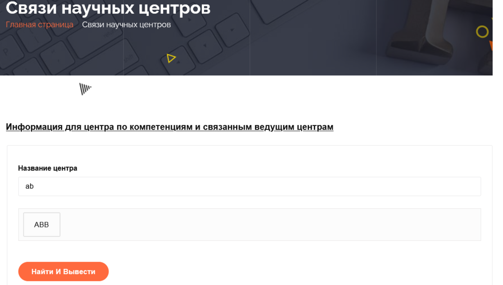

## Интерфейс страницы связанных ведущих центров
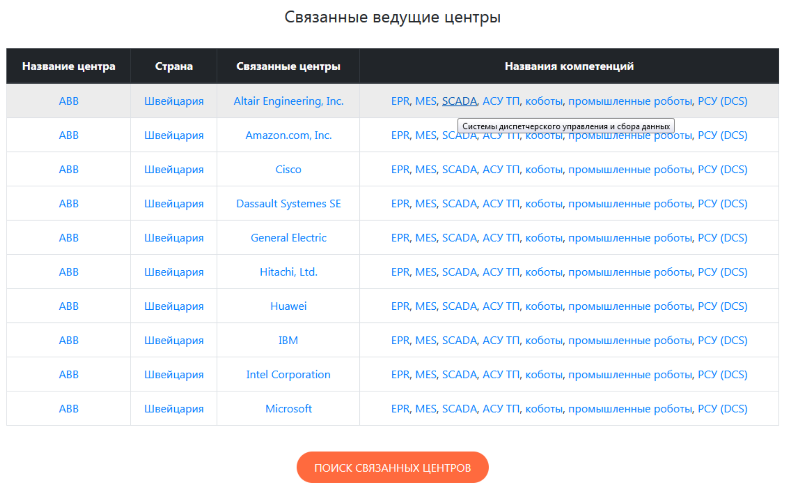

## Интерфейс страницы поиска поставщиков
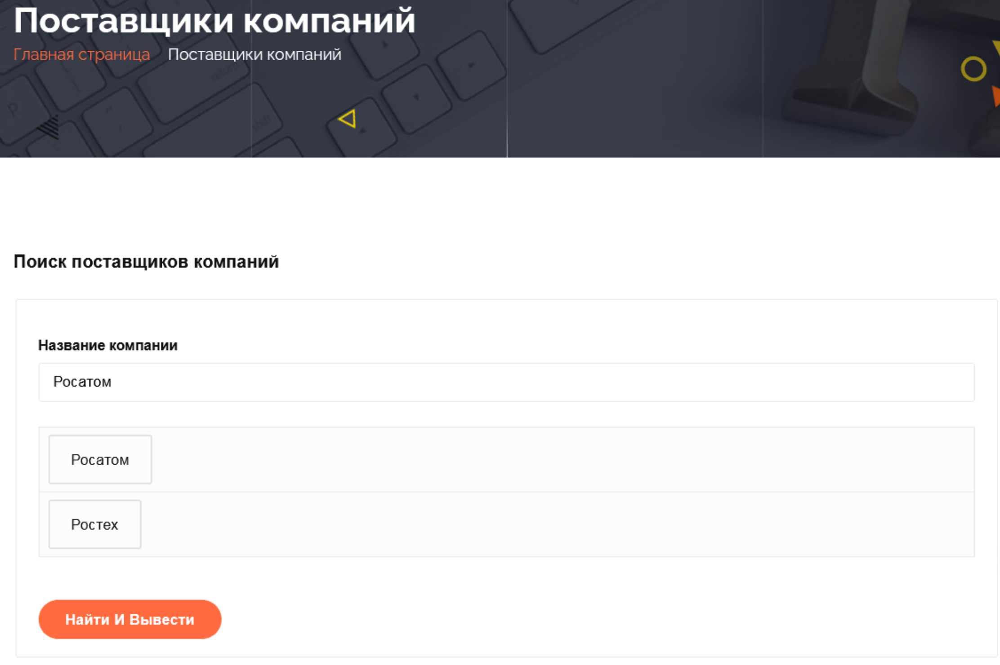

## Интерфейс страницы поставщиков выбранной компании
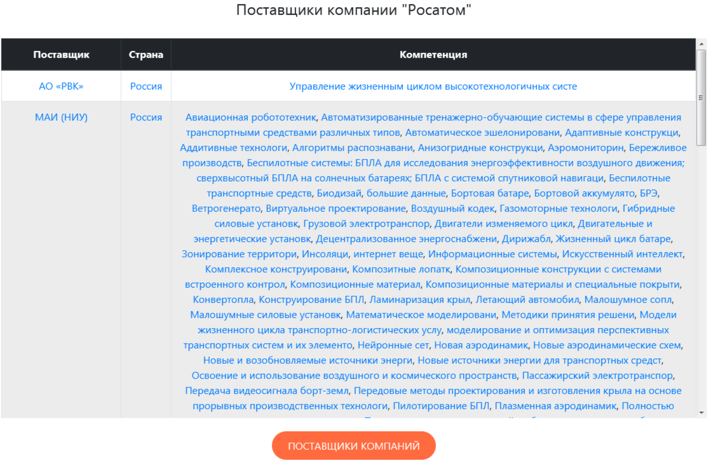
